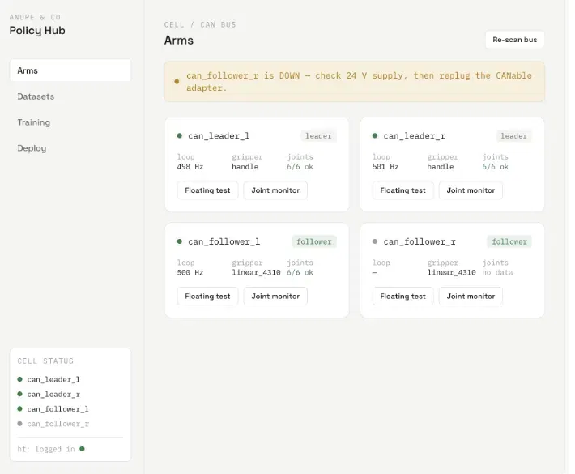

# `ctrl-π`

`ctrl-π` is a minimal, local-first control plane for developing, recording,
training, and running robot policies on YAM arms.

<p align="center">
  
</p>

The screenshot is visual inspiration, not a product specification. The canonical
requirements live in [SPEC.md](SPEC.md).

## Current status

Milestones 1 and 2 are implemented. The React, TypeScript, Vite, and Tailwind
application shell has exactly five primary views:

1. **Arms** — connected YAM status, telemetry, diagnostics, and manual-control
   affordances.
2. **Record / Teleop** — leader/follower operation and LeRobot-oriented
   demonstration recording.
3. **Datasets** — Hugging Face dataset discovery and, later, synchronized
   episode inspection.
4. **Training** — tracked runs and model artifacts, with separate Runs and
   Models subviews.
5. **Inference** — policy runtime, checkpoint, compute target, and endpoint
   control.

The backend now has a validated FastAPI application factory, SQLAlchemy 2 models,
and a reversible Alembic migration for the seven V1 control-plane tables. The
current screens still use typed mock fixtures and intentionally disabled hardware
actions. API resources, Hugging Face, YAM, worker, and compute integrations arrive
in later milestones. Compute is shared by Training and Inference; it is not a
sixth primary view.

## Quick start

Requirements: a supported Node.js release (`^20.19`, `^22.13`, or `>=24`) and
npm.

```bash
cd frontend
npm install
npm run dev
```

Open the URL printed by Vite. The UI runs without hardware or credentials.

Run the milestone checks with:

```bash
cd frontend
npm run lint
npm test
npm run build
```

Backend development requires Python 3.12 and PostgreSQL. Setup and migration
commands are documented in [`backend/README.md`](backend/README.md); PostgreSQL
is not required to preview the Milestone 1 UI.

## Repository layout

```text
ctrl-pi/
├── frontend/          React + TypeScript control-plane UI
├── backend/           FastAPI composition, SQLAlchemy models, and Alembic
├── worker/            planned ctrl-pi-worker package
├── docs/              focused design and operating notes
├── SPEC.md            canonical product and technical specification
└── AGENTS.md          contribution guidance for coding agents
```

The intended boundary is:

```text
UI → ctrl-π API → services/interfaces → PostgreSQL / Hugging Face / YAM / ComputeTarget
```

Policy observations and actions do not traverse the ctrl-π API once an
inference service is loaded. The robot-side client talks directly to the native
LeRobot or OpenPI policy server.

## Configuration

Copy `.env.example` to `.env` before running the backend. `DATABASE_URL` points
to ordinary PostgreSQL; Supabase is only the recommended hosted default.
`HF_TOKEN`, SSH credentials, and Modal credentials are server/local-machine
secrets and must never be exposed to browser code or committed.

## Documentation

- [Architecture](docs/architecture.md)
- [Development](docs/development.md)
- [YAM driver boundary](docs/yam-driver.md)
- [Recording and teleoperation](docs/recording-teleop.md)
- [Compute targets](docs/compute-targets.md)
- [Policy runtimes](docs/policy-runtimes.md)

## License

An open-source license has not yet been selected. A `LICENSE` file must be added
before the project is presented as licensed for redistribution.
